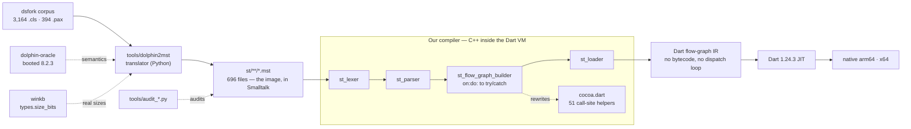
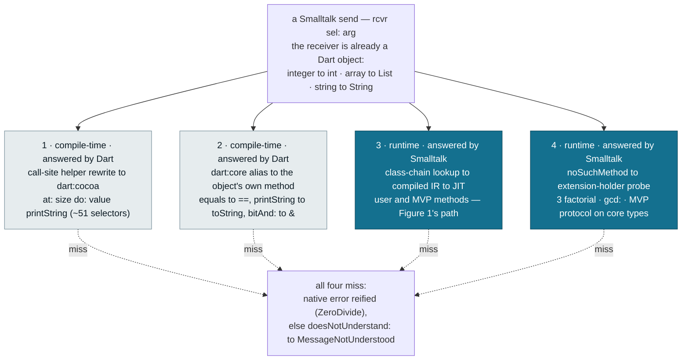
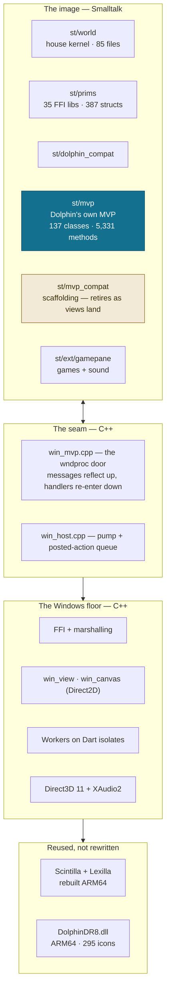

# DolphinDart

**Status: 0% complete.**

A port of **Dolphin Smalltalk 8** — its language layer, the Windows primitives it
needs, and above all its **Model-View-Presenter GUI framework** — onto the
**Dart 1.24.3 VM**. Smalltalk is compiled straight to Dart flow-graph IR and run
by the Dart JIT; there is no bytecode interpreter anywhere in the path. One
source tree targets Windows **x64** and **ARM64**.

**"Done" is not "it runs."** It is every ported class proven behaviorally
equivalent to Dolphin — method by method, against a live Dolphin 8.2.3 oracle
for semantics, and winkb plus a real 64-bit run for layout. Translating the
corpus, building the compiler, and getting the first real view on screen were
all prerequisites to *beginning* that proof. Against the conformance bar, ~99%
of the work remains — hence 0%.

## Design

Three views of the architecture: how Dolphin source becomes native code, how the
object model fuses with Dart's, and what the running image stands on. The full
version — with the scope doctrine, status ledger and the traps that shaped it —
is in [docs/design-overview.html](docs/design-overview.html) (open in a browser).

### 1. Source to machine code

Dolphin's chunk files are translated to the house dialect ahead of time, then a
C++ front end inside the VM compiles them to Dart IR. Dolphin's own 32-bit VM is
nowhere on this path — it is reading material, not a dependency.

### 2. The object model is fused

The core classes are not ported — they *are* Dart's own: a `SmallInteger` is a
Dart `int`, an `Array` is a Dart `List`, a `String` literal is a Dart `String`.
Nothing is boxed. The price of that fusion is dispatch: a single Smalltalk send
can be answered in four places, and only two of them are Smalltalk.

The core types are **sealed** Dart classes, so Smalltalk's extra protocol lives
on a parallel `"<Name> ext"` holder, reached only when the first three paths miss:

| Smalltalk class | Is, at runtime | ST-only protocol reached via |
|---|---|---|
| SmallInteger / LargeInteger | one Dart `int` — arbitrary precision | path 4, on `Integer ext` |
| Float | Dart `double` | path 4, on `Float ext` |
| String | Dart `String`, immutable | path 4; mutation falls back to a char buffer (a `List`) |
| Symbol | interned Dart `String` | path 4, on `Symbol ext` |
| Array | Dart `List` — `#(…)`, `Array new:`, every `collect:` | path 4, on `Array ext` |
| Character | one of 256 canonical `StChar` | path 4, on `Character ext` |

Exceptions ride the same fusion: `on:do:`/`ensure:` lower onto Dart
`try`/`catch`/`finally`, `signal` becomes a Dart `throw`, and `become:` is the
VM's own primitive — the machinery is Dart's, the hierarchy is Smalltalk's.

### 3. What the running image stands on

Above the seam is Smalltalk; below it is C++ or Dart, whichever fits. The seam is
a real wndproc that re-enters the image synchronously, to any depth.

## History

The original project README — the full mission statement plus the WINDART
substrate's build and layout documentation — is preserved at
[README.origin.md](README.origin.md).
